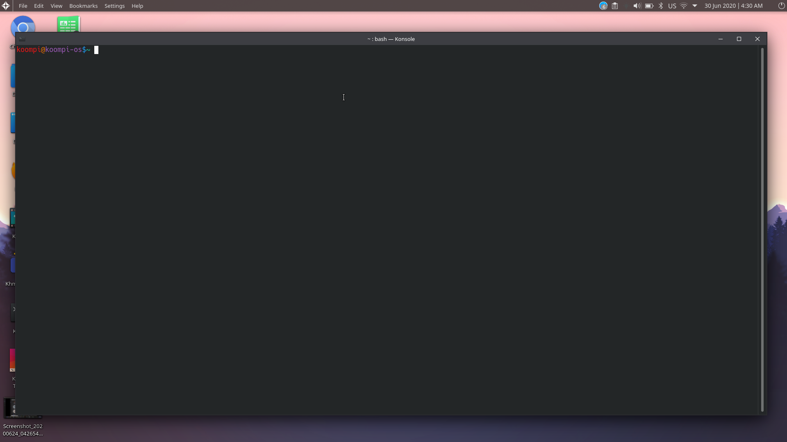
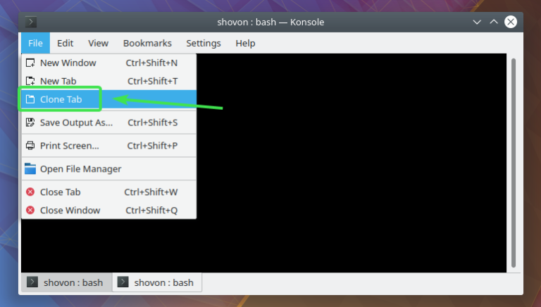
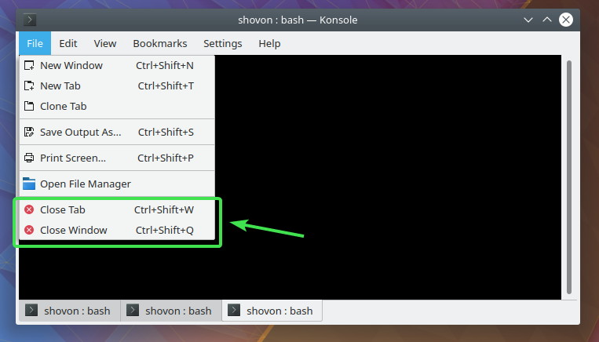
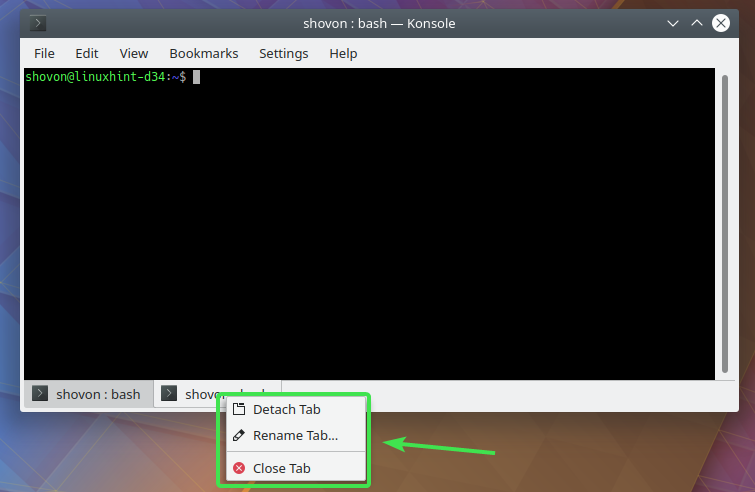

Konsole is the default terminal app of `KDE Desktop Environment`. In this article, we will introduce you about how konsole work. So, let’s get started.

----
----

Basics of Konsole Terminal:

To run a command, just type it in and press `Enter `. The command should run and print the output in the Konsole display like below.

For example, To update the system with command `pi -Syu`

### Working with Tabs and Windows 

To create a new tab, click on **Left Side Corner > File > New Tab.**

To create a new window, click on **Left Side Corner File > New Window.**

Once a new tab is `created`, it will show up in the tab bar down below in terminal as you can see in the image below. You can switch between them very easily.

You can also clone tab from **Left Side Corner > File > Clone Tab.**

To close a tab, click on **Left Side Corner > File > Close Tab.**

To close a window, click on **Left Side Corner > File > Close Window.**

You can also `right click on a tab` and `detach` (Detach Tab), rename (Rename Tab…) and close (Close Tab) the tab.

### Opening File Manager in Current Working Directory
If you want to open the directory you’re currently in on the Konsole terminal with Dolphin file manager, click on **Left Side Corner > File > Open File Manager.**

The directory should be opened in `Dolphin`.

### Printing and Saving Terminal Output
To save the output of Konsole terminal to a file, click on **Left Side Corner > File > Save Output As**

Now, select a location and a filename and click on Save.

You can click on the Filter dropdown menu and select between plain text document format (default) and HTML format.

Konsole output saved to plain text file.
<!-- https://linuxhint.com/konsole_terminal_app/ -->

To print the output, click on File > Print Screen…

### Searching Terminal Display
To search for text in the Konsole, click on Edit > Find…

### Copying and Pasting Text
To copy text, select the text, right click and select Copy.

To paste, right click and select Paste.

### Enlarging Font, Shrinking font and Setting Character Encoding
To increase the font size on the fly, click on View > Enlarge Font.

To decrease the font size on the fly, click on View > Shrink Font.

If you want to set a character set or encoding, click on View > Set Encoding and select your desired character set.

### Konsole Split View

To split the Konsole view horizontally, click on View > Split View > Split View Left/Right.

To split the Konsole view vertically, click on View > Split View > Split View Top/Bottom.


You can split Kosole horizontally or vertically.


To close the active split view, click on View > Split View > Close Active.

To close the inactive split view, click on View > Split View > Close Others.

### Hiding Menubar and Fullscreen Mode
To hide the Konsole menubar, uncheck **Settings > Show Menubar.**

To display the menubar again, right click on the terminal and check Show Menubar.

To go to full screen, check Settings > Full Screen Mode.

Once you’re in full screen mode, press F11 to exit out of full screen mode.

### Configuring Konsole

To configure Konsole global settings, go to Settings > Configure Konsole

From the General tab, you can configure default Konsole Window settings.

You can also configure the Default Search Settings from here.

From the TabBar tab, you can set when the tab bar will be visible and the position of the tab bar.

You can also set where new tabs will be placed from the TabBar tab.